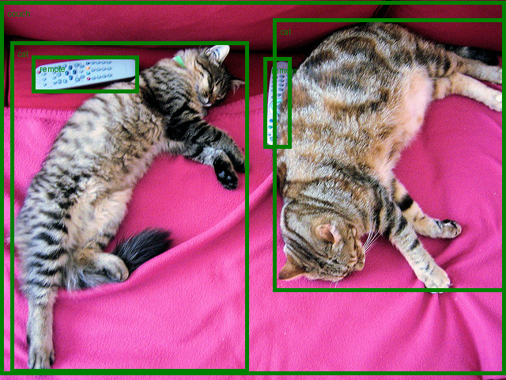

# Test Detect Objects

## Input Image

## Output Image

## Object Detection Results

| Object | Confidence | Location |
|--------|------------|----------|
| remote | 0.998 | [40.16, 70.81, 175.55, 117.98] |
| remote | 0.996 | [333.24, 72.55, 368.33, 187.66] |
| couch | 0.995 | [-0.02, 1.15, 639.73, 473.76] |
| cat | 0.999 | [13.24, 52.05, 314.02, 470.93] |
| cat | 0.999 | [345.4, 23.85, 640.37, 368.72] |
